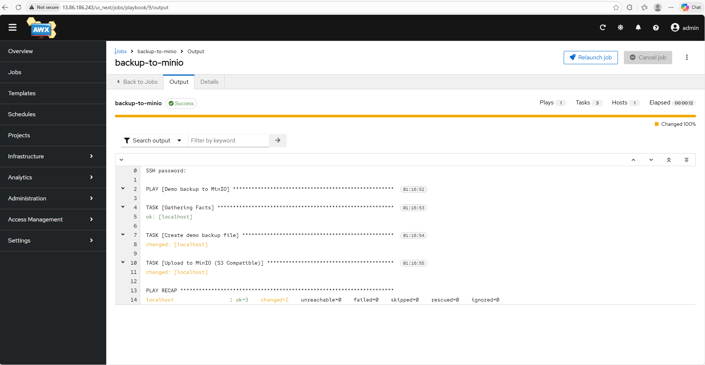
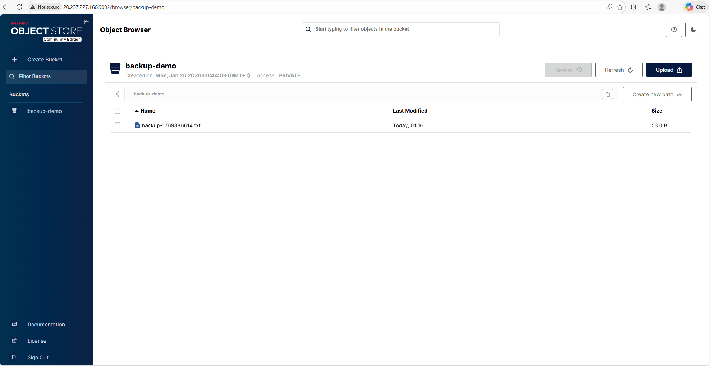

# Azure AKS DevOps Platform

This repository demonstrates an **enterprise-grade Azure DevOps platform on AKS**, designed to support **secure, scalable, and observable cloud-native workloads**.

The project reflects real-world **DevOps Engineering responsibilities**: designing, implementing, and operating Azure-based infrastructure using **Infrastructure as Code, Kubernetes, CI/CD automation, and observability best practices**.

The application layer is intentionally kept simple so that attention remains on **platform reliability and operational excellence**:
AKS operations, automation workflows, observability, GitOps, and SRE-aligned patterns.

---

## What This Project Proves

- Azure-native AKS platform design
- Terraform-based infrastructure provisioning
- Modular and reusable Terraform structure
- Kubernetes platform operations on AKS
- AWX (Ansible Automation Platform) on Kubernetes
- MinIO-based object storage simulation
- Automated backup workflows using Ansible + AWX
- Observability with Prometheus & Grafana
- Production-oriented repository layout
- SRE / DevOps mindset (automation, monitoring, recovery)

---

## High-Level Architecture

```
User / Developer
        |
        v
Terraform (infra/)
        |
        v
Azure:
  - Resource Group
  - VNet + Subnet
  - AKS Cluster
  - Azure Container Registry (ACR)
        |
        v
AKS Platform:
  - AWX Operator & AWX Instance
  - MinIO Object Storage
  - Backup Jobs
  - Prometheus & Grafana
        |
        v
Automation:
  - Ansible Playbooks
  - AWX Jobs
  - Git-based workflows
```

---

## Repository Structure

```
azure-cloud-infra-project/
├── README.md
├── docs/
│   └── screenshots/
├── ansible/
│   ├── inventories/
│   └── playbooks/
├── infra/
│   ├── main.tf
│   ├── providers.tf
│   ├── variables.tf
│   ├── outputs.tf
│   ├── terraform.tfvars
│   └── .terraform.lock.hcl
├── platform/
│   ├── main.tf
│   └── providers.tf
├── kubernetes/
│   ├── automation/
│   │   ├── awx/
│   │   └── awx-operator/
│   ├── storage/
│   │   └── minio/
│   ├── backup_jobs/
│   └── observability/
└── README.md
```

---

## Demo Scenario: Automated Backup to Object Storage

This demo validates **end-to-end operational automation** using Kubernetes-native tooling and Ansible automation.

### Flow Overview

1. AWX runs an Ansible playbook
2. A demo backup artifact is generated
3. The artifact is uploaded to MinIO (S3-compatible storage)
4. Backup success is verified via AWX output and MinIO UI

### Demo Evidence

#### AWX Job Execution (Backup to MinIO)

The screenshot below shows a successful AWX job execution where an Ansible playbook:
- creates a demo backup artifact
- uploads it to MinIO object storage



---

#### MinIO Object Storage (Backup Artifact)

The screenshot below confirms that the backup artifact has been successfully stored
inside the MinIO bucket.



---

## Tooling & Technologies

- Microsoft Azure
- Terraform
- Azure Kubernetes Service (AKS)
- Ansible & AWX
- MinIO
- Prometheus & Grafana
- Kubernetes & Docker

---

## Project Scenarios

1. Provision AKS using Terraform
2. Deploy AWX on AKS
3. Connect AWX to Git repositories
4. Deploy MinIO object storage
5. Run automated backup jobs
6. Observe metrics in Grafana

---

## 👤 Author

Thomas Waas
